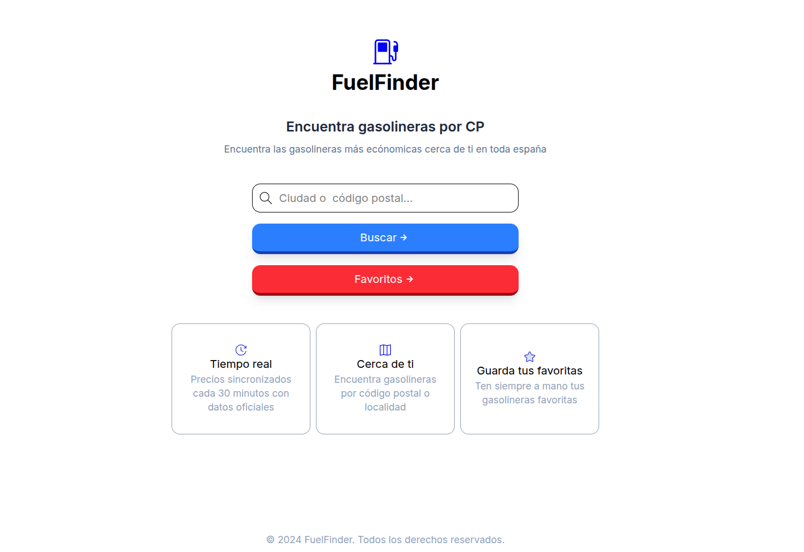
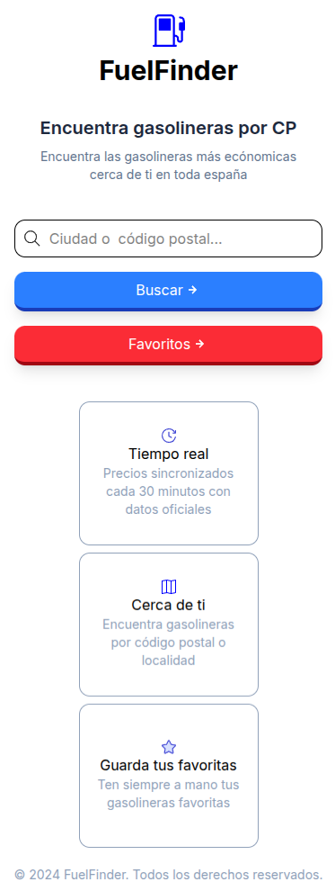
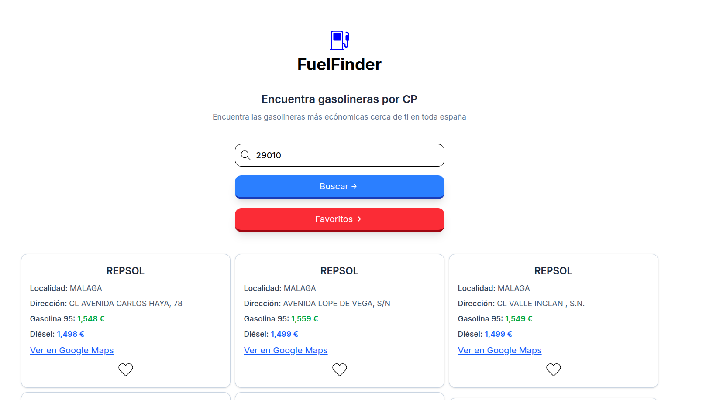
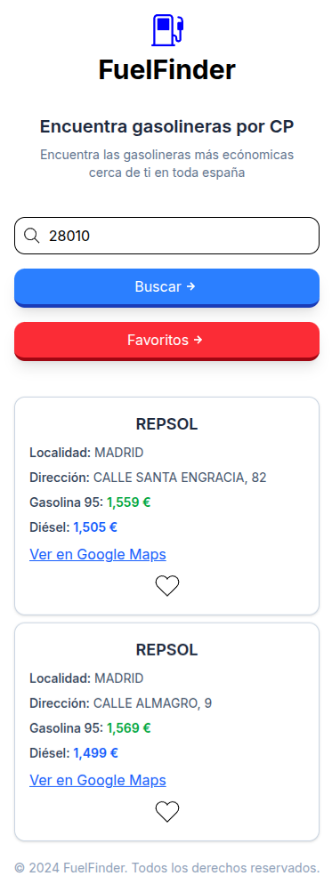
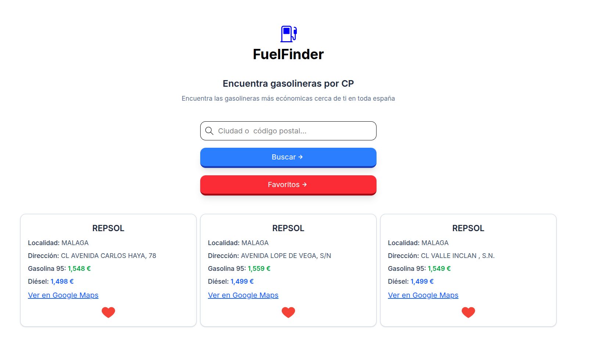
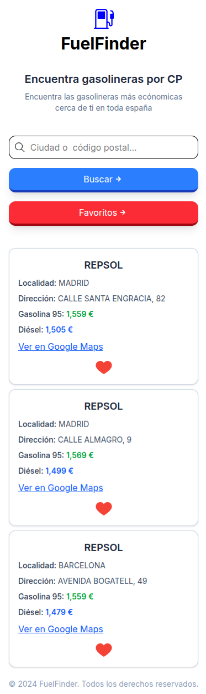

# FuelFinder

# ⛽ Buscador de Gasolineras

Aplicación web desarrollada con **React + Vite** que permite buscar gasolineras por **ciudad o código postal**, consultar precios y guardar gasolineras en **favoritos** con persistencia en `localStorage`.

## 🚀 Demo
[FuelFinder](https://harmonious-entremet-ef3b03.netlify.app/)

---

## 🚀 Funcionalidades

- 🔍 Búsqueda por:
  - Ciudad
  - Código postal
- 💾 Guardado de gasolineras favoritas
- ❤️ Sistema de favoritos tipo toggle
- 🧠 Persistencia de datos con `localStorage`
- ⚡ Carga dinámica de datos desde API
- 📱 Diseño responsive

---

## 🛠️ Tecnologías usadas

- React
- Vite
- JavaScript (ES6+)
- Tailwind CSS
- API pública de precios de carburante
- Netlify (deploy)

---

## 📦 Instalación

Clona el repositorio:

git clone https://github.com/tu-usuario/tu-repo.git
npm install
npm run dev 

Build de produccion
npm run build
dist/ 

---

## 🌐 Despliegue en Netlify (SPA)
El proyecto incluye configuración para evitar errores 404 al recargar:
Archivo _redirects en dist:
/*    /index.html   200

---

## 📌 Pendientes / mejoras futura
🔄 Ordenar por precio
📍 Geolocalización
🗺️ Integrar mapa

---

## 🖼️ Capturas

### Pantalla principal

### Resultados de búsqueda

### Favoritos

---

## 👨‍💻 Autor

Desarrollado por jrcaravaca
Proyecto personal enfocado a mi formación en desarollo FullStack

